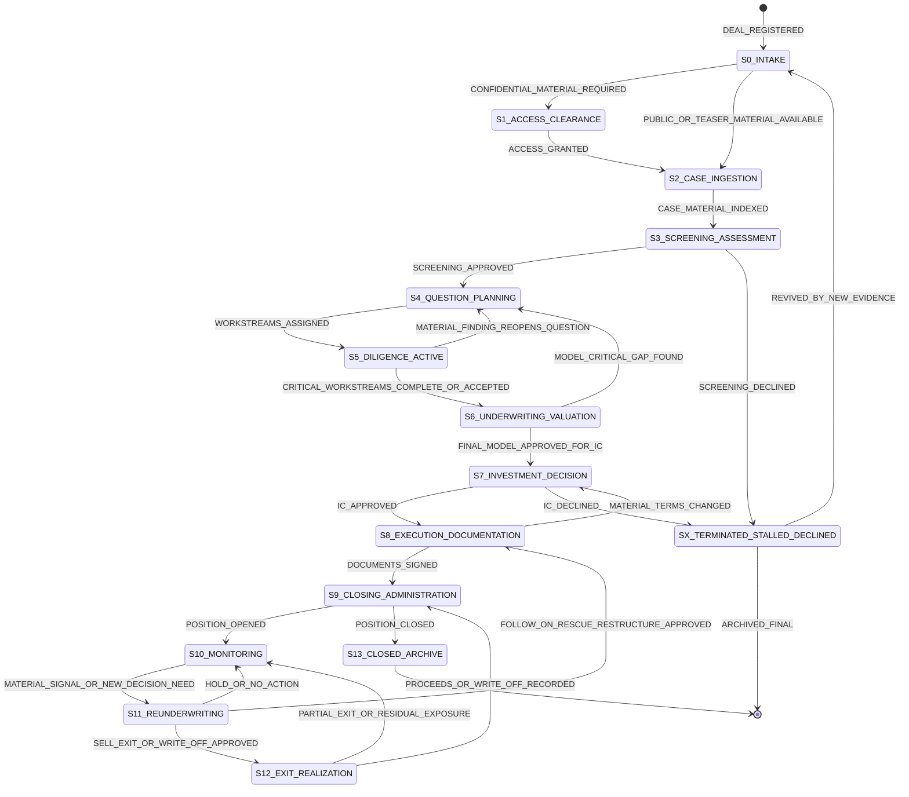

# PE Buyout Workflow Engineering Spec — V1

**Status:** Implementation-ready workflow backbone. Object types remain provisional until ontology integration.  
**Purpose:** Define the state machine, transition rules, workstream dependencies, and enforcement semantics required to implement a PE buyout workflow engine.  
**Schema note:** Ontology integration may rename, split, or formalize object types without changing the workflow backbone.

## 1. Implementation properties

The specification defines five implementation properties:

1. **Deterministic state resolution.** Each state has explicit entry and exit predicates, and the primary state is selected from authoritative events, exposure status, and unresolved blockers.
2. **Explicit transition semantics.** Every transition has a trigger, guard condition, action, ordering logic, and exception route.
3. **Parallel workstream execution.** Diligence, control, structuring, modeling, and drafting activities can run concurrently while material blockers remain enforceable.
4. **First-class unhappy paths.** Decline, stall, backtrack, skipped states, support decline, partial realization, failed signing, and revival are represented explicitly.
5. **Traceable reasoning and authority.** Questions, assumptions, evidence, risks, risk acceptances, decisions, execution artifacts, monitoring signals, and outcomes remain linked throughout the workflow.

## 2. Execution model

A deal has:

- one **primary workflow state**;
- many **parallel WorkstreamTask objects**;
- a linked set of typed objects representing questions, assumptions, evidence, risks, model cases, decisions, execution documents, live positions, monitoring signals, re-underwriting records, exceptions, and outcomes.

The engine must not infer the primary state from the newest file. It must derive the state from **WorkflowEvent objects, authority decisions, exposure status, completed artifacts, and unresolved blockers**.

## 3. Core object types — provisional schema

| Object type | Definition |
|---|---|
| `DealRecord` | Canonical record for an investment opportunity or live position, including identity, ownership, process type, status, responsible owner, and linked workflow objects. |
| `AccessGrant` | Authorization record defining whether and how confidential materials may be received, stored, reviewed, shared, and used. |
| `SourceMaterialSet` | Versioned set of source materials and source claims received from a sponsor, seller, company, adviser, or public source. |
| `ScreeningAssessment` | Preliminary assessment that converts the source case into a resource-allocation decision, initial thesis, and initial risk set. |
| `QuestionRegister` | Living register of decision-relevant questions, owners, statuses, required evidence, answers, blockers, and escalation needs. |
| `WorkstreamTask` | Assigned unit of work linked to a question or required output, with owner, status, dependencies, due date, materiality, and completion criteria. |
| `WorkstreamOutput` | Typed deliverable from a diligence, control, execution, or monitoring workstream, including findings, evidence basis, materiality, and downstream consumers. |
| `Assumption` | Proposition about the company, market, economics, structure, or outcome that must be supported, tested, sensitivity-analyzed, risk-accepted, or revised. |
| `EvidenceItem` | Document, datapoint, analysis, response, call note, diligence finding, or external proof used to support, challenge, or supersede a claim or assumption. |
| `RiskRecord` | Structured risk with category, materiality, evidence basis, owner, mitigation, status, and decision or valuation impact. |
| `RiskAcceptanceRecord` | Explicit authority decision to proceed despite unresolved risk or uncertainty, including scope, rationale, conditions, owner, and expiry or review trigger. |
| `ModelCase` | Structured financial scenario such as base, downside, upside, sponsor, management, or re-underwritten case. |
| `ValuationCase` | Valuation and return construct linking the financial basis, operating assumptions, capital structure, security terms, exit assumptions, and return outputs. |
| `DecisionRecord` | Explicit authority decision with date, decision body, recommendation, outcome, conditions, allocation, and linked risk acceptances. |
| `ExecutionDocumentSet` | Version-controlled set of legal, tax, structuring, transaction, subscription, amendment, financing, or funding documents implementing an approved action. |
| `PositionRecord` | Post-close record of live or residual exposure, cost basis, ownership or security, cash flows, proceeds, obligations, and monitoring baseline. |
| `MonitoringSignal` | Detected or reported variance, event, KPI change, valuation movement, covenant issue, liquidity need, sale process, sponsor event, or review trigger that may require action. |
| `ReunderwritingRecord` | Current assessment comparing updated conditions with the prior underwriting baseline and recommending hold, sell, follow-on, rescue, restructure, impair, write off, or no action. |
| `OutcomeRecord` | Record of a realized, partially realized, impaired, restructured, written-off, or closed-position outcome, including economics and residual exposure. |
| `ExceptionRecord` | Structured record of a skipped state, backtrack, decline, stall, unresolved gate, late artifact, abandoned action, or other workflow deviation. |
| `WorkflowEvent` | Immutable event recording a state-relevant occurrence, actor, timestamp, related objects, and payload, and capable of triggering a workflow transition. |

## 4. State-resolution rule

A deal may have many active workstreams, but only one primary workflow state. Resolve the state from authoritative events, exposure status, and unresolved blockers rather than folder names or document labels.

1. If PositionRecord.status == 'closed', final capital effects are reconciled, and residual obligations are captured -> S13_CLOSED_ARCHIVE.
2. If an exit, realization, or write-off decision or process is active and the OutcomeRecord is not yet complete or routed to administration -> S12_EXIT_REALIZATION.
3. If a ReunderwritingRecord is active or a material MonitoringSignal remains unresolved -> S11_REUNDERWRITING.
4. If a signed, funded, proceeds, or write-off event exists and position or capital records remain unreconciled -> S9_CLOSING_ADMINISTRATION.
5. If a live or residual PositionRecord exists and no higher-priority workflow is unresolved -> S10_MONITORING.
6. If a terminal ExceptionRecord is active and no live or residual PositionRecord exists -> SX_TERMINATED_STALLED_DECLINED.
7. If an approved action is in legal, structuring, documentation, or signing -> S8_EXECUTION_DOCUMENTATION.
8. If a decision package is submitted or an authority decision is pending -> S7_INVESTMENT_DECISION.
9. If the final model or valuation is being prepared for decision -> S6_UNDERWRITING_VALUATION.
10. If diligence workstreams are active -> S5_DILIGENCE_ACTIVE.
11. If the QuestionRegister or workstream plan is active or reopened -> S4_QUESTION_PLANNING.
12. If a ScreeningAssessment is pending -> S3_SCREENING_ASSESSMENT.
13. If source materials are being indexed and claims extracted -> S2_CASE_INGESTION.
14. If confidential access is required and unresolved -> S1_ACCESS_CLEARANCE.
15. Otherwise, a new or unresolved opportunity -> S0_INTAKE.

**Conflict rule:** When multiple states appear active, select the first state in the priority order whose unresolved condition is true. Do not use the most recently uploaded document as the state determinant.

**Document-label rule:** Document labels are evidence, but never sufficient to set state. A state requires an authoritative event, decision, exposure status, or typed-artifact condition.

## 5. State machine

### State table

| State | Purpose | Entry condition | Exit condition | Main blockers |
|---|---|---|---|---|
| `S0_INTAKE` Opportunity intake and identity resolution | Create a canonical deal record and map the opportunity to the right company, sponsor/counterparty, vehicle, owner, and process context. | DealRecord.status == 'new' OR DealRecord.canonical_identity_status != 'resolved'. | DealRecord.canonical_identity_status == 'resolved' AND DealRecord.owner_id is not null AND DealRecord.process_type is assigned. | duplicate_or_alias_conflict_unresolved; no_owner_assigned; vehicle_eligibility_unknown |
| `S1_ACCESS_CLEARANCE` Access and confidentiality clearance | Determine whether the team may receive, store, review, and use non-public materials. | DealRecord.requires_confidential_materials == true AND no AccessGrant.status in ['granted','waived_public_only'] exists. | AccessGrant.status in ['granted','waived_public_only'] OR (AccessGrant.status == 'denied' AND ExceptionRecord exists). | confidential_material_received_without_access_grant; restricted_party_conflict; NDA_not_executed_when_required |
| `S2_CASE_INGESTION` Source case ingestion | Ingest the sponsor/seller/company case and convert incoming materials into a structured set of claims to test. | At least one SourceMaterialSet exists AND every included material has an access basis of 'granted' or 'waived_public_only'. | SourceMaterialSet.index_status == 'indexed' AND initial_claims_extracted == true. | no_investable_case_material; material_set_not_indexed; key_source_provenance_unknown |
| `S3_SCREENING_ASSESSMENT` Initial assessment and resource-allocation screen | Decide whether the opportunity deserves diligence resources and define the initial investment question. | SourceMaterialSet.index_status == 'indexed' AND ScreeningAssessment.status is null or 'draft'. | ScreeningAssessment.decision in ['proceed_to_diligence','decline','defer','proceed_by_exception']. | no_screening_rationale_before_heavy_diligence; fund_fit_unresolved; material_conflict_not_cleared |
| `S4_QUESTION_PLANNING` Question engine and diligence planning | Convert uncertainty into owned questions, required evidence, and workstream tasks. | ScreeningAssessment.decision in ['proceed_to_diligence','proceed_by_exception'] AND QuestionRegister.status in [null,'draft','reopened']. | QuestionRegister.status == 'baselined' AND every critical question has an owner, status, evidence_needed, and target_workstream; any unresolved critical question is marked as blocking or as requiring a RiskAcceptanceRecord. | critical_question_without_owner; critical_question_without_evidence_need; critical_question_without_target_workstream; question_register_not_updated_after_material_finding |
| `S5_DILIGENCE_ACTIVE` Parallel diligence workstreams active | Run financial, commercial, operational, management, legal, tax, financing, and structuring workstreams to test questions and assumptions. | QuestionRegister.status in ['baselined','reopened'] AND at least one WorkstreamTask.status == 'active'. | All critical WorkstreamTask.status values are in ['complete','waived','risk_accepted'] AND every material WorkstreamOutput is linked to a QuestionRegister item, Assumption, RiskRecord, or ValuationCase. | critical_workstream_incomplete; material_finding_unassigned; evidence_gap_on_model_critical_assumption; legal_red_flag_unresolved_when_signing_relevant |
| `S6_UNDERWRITING_VALUATION` Model, valuation and return underwriting | Convert tested assumptions into economics, downside/upside cases, capital structure, security terms, and return analysis. | At least one ModelCase.status is in ['draft','active']. | ValuationCase.status == 'IC_ready' AND every model-critical assumption is supported, sensitivity-tested, or linked to a RiskAcceptanceRecord. | final_valuation_without_verified_financial_basis; unsupported_growth_or_margin_assumption; security_terms_missing; downside_case_absent_for_material_risk |
| `S7_INVESTMENT_DECISION` Investment decision / approval gate | Approve, decline, defer, or condition the investment decision based on evidence, economics, risks, and unresolved questions. | ValuationCase.status == 'IC_ready' AND IC_package_or_equivalent exists. | DecisionRecord.decision in ['approved','declined','deferred','approved_with_conditions']. | critical_question_unanswered_without_risk_acceptance; final_model_absent; decision_authority_missing; approval_conditions_untracked |
| `S8_EXECUTION_DOCUMENTATION` Structuring, legal documentation and signing | Translate approved economics and rights into executable documents and conditions. | DecisionRecord.decision in ['approved','approved_with_conditions'] AND ExecutionDocumentSet.status in [null,'draft','negotiation']. | ExecutionDocumentSet.status == 'signed' OR (ExecutionDocumentSet.status == 'execution_abandoned' AND ExceptionRecord exists); every material deviation from DecisionRecord is absent, waived, or re-approved. | legal_authority_missing; terms_deviate_from_approval_without_reapproval; material_tax_issue_unresolved; document_version_not_final |
| `S9_CLOSING_ADMINISTRATION` Closing and capital administration | Record the binding investment, funding, cost basis, ownership/security, proceeds, and capital account effects. | (ExecutionDocumentSet.status == 'signed' AND a closing workflow is active) OR a funding, proceeds, partial-realization, or write-off event exists. | PositionRecord.status is in ['live','closed','residual'] AND cash, capital-account, ownership-or-security, and proceeds effects are reconciled. | funding_without_executed_authority; cost_basis_missing_after_close; ownership_or_security_record_missing; proceeds_unreconciled_after_exit |
| `S10_MONITORING` Monitoring and portfolio reporting | Track live exposure against underwriting baseline, valuation, performance, covenants, liquidity, and exit conditions. | PositionRecord.status in ['live','residual'] AND no higher-priority re-underwriting, exit-realization, or administration workflow is unresolved. | A material MonitoringSignal or new decision need opens re-underwriting; a sale or realization event opens exit realization; PositionRecord.status == 'closed' opens archive routing. | live_position_without_monitoring_baseline; material_variance_not_triaged; new_money_request_without_reunderwriting |
| `S11_REUNDERWRITING` Re-underwriting and outcome calibration | Compare current evidence to prior underwriting and decide hold, sell, follow-on, rescue, restructure, impair, or no action. | MonitoringSignal.materiality in ['material','trigger'] OR a follow-on request, liquidity or covenant issue, exit opportunity, impairment indicator, or time-based review requires a new decision. | ReunderwritingRecord.recommendation is resolved AND any required DecisionRecord is resolved for a material action. | update_report_treated_as_exit_without_explicit_exit_decision; new_money_without_old_vs_new_money_analysis; material_action_without_approval_route; monitoring_trigger_unresolved |
| `S12_EXIT_REALIZATION` Exit, realization and outcome decision | Execute or evaluate a sale, partial sale, realization, write-off, or terminal outcome based on current outcome-calibration analysis. | ReunderwritingRecord.recommendation in ['sell','exit','write_off'] with required authority approval, OR an external sale-process or realization event exists. | OutcomeRecord.status in ['realized','partially_realized','deferred_hold','written_off'] AND capital_admin_update_required is routed. | exit_classified_from_label_only; sell_decision_without_current_return_bridge; realization_without_capital_admin_update; residual_exposure_not_recorded |
| `S13_CLOSED_ARCHIVE` Closed-position archive and realized outcome record | Close the workflow when exposure is zero or explicitly archived with residual obligations captured. | (PositionRecord.status == 'closed' OR OutcomeRecord.status in ['fully_realized','written_off']) AND residual_obligations_status in ['none','captured'] AND final capital effects are reconciled. | Terminal state; can only reopen through REVIVAL_OR_CORRECTION_EVENT. | residual_obligation_unknown; final_proceeds_unreconciled; realized_return_record_missing |
| `SX_TERMINATED_STALLED_DECLINED` Terminated, stalled, declined or abandoned path | Record a negative or inactive process outcome with reason code and revival conditions. | (DecisionRecord.decision == 'declined' OR ExceptionRecord.reason in ['access_denied','diligence_red_flag','terms_changed','timing_missed','process_lost','stalled','out_of_scope','support_declined']) AND no live or residual PositionRecord exists. | Terminal unless RevivalEvent.exists == true with new material evidence, terms, process access, or authority approval. | no_reason_code; declined_or_stalled_without_last_active_stage; revived_without_new_trigger |

## 6. Transition register

| ID | From | To | Trigger | Guard | Action | Transition type | Ordering logic | Exception route |
|---|---|---|---|---|---|---|---|---|
| `T00` | `START` | `S0_INTAKE` | DEAL_REGISTERED | No active canonical DealRecord exists for the same opportunity, or an explicit related-process record is required. | Create DealRecord; resolve or queue identity matching; assign preliminary owner and process type. | `BLOCKS_NEXT_STATE` | `LOAD_BEARING` | If duplicate identity unresolved, remain in S0 with duplicate_conflict flag. |
| `T01` | `S0_INTAKE` | `S1_ACCESS_CLEARANCE` | CONFIDENTIAL_MATERIAL_REQUIRED | DealRecord.identity_resolved == true AND confidential material is needed before further case review. | Open access/NDA task; block confidential ingestion until resolved. | `BLOCKS_CONFIDENTIAL_INGESTION` | `LOAD_BEARING` | If only public/teaser review is needed, bypass to S2 with public_only waiver. |
| `T02` | `S0_INTAKE` | `S2_CASE_INGESTION` | PUBLIC_OR_TEASER_MATERIAL_AVAILABLE | DealRecord.identity_resolved == true AND AccessGrant.status == 'waived_public_only'. | Ingest public/teaser materials and mark confidentiality basis. | `ALLOWED_SKIP_WITH_WAIVER` | `CONDITIONAL_LOAD_BEARING` | If confidential materials arrive, route back to S1. |
| `T03` | `S1_ACCESS_CLEARANCE` | `S2_CASE_INGESTION` | ACCESS_GRANTED or NDA_EXECUTED or PUBLIC_ONLY_EXCEPTION_APPROVED | AccessGrant.status in ['granted','waived_public_only']. | Permit source material ingestion under confidentiality rules. | `BLOCKS_NEXT_STATE` | `LOAD_BEARING` | ACCESS_DENIED routes to SX with reason_code='access_denied'. |
| `T04` | `S2_CASE_INGESTION` | `S3_SCREENING_ASSESSMENT` | CASE_MATERIAL_INDEXED | SourceMaterialSet.index_status == 'indexed' AND initial_claims_extracted == true. | Generate or request ScreeningAssessment. | `BLOCKS_SCREENING` | `LOAD_BEARING` | If source materials insufficient, route to SX or remain S2 with information_request_pending. |
| `T05` | `S3_SCREENING_ASSESSMENT` | `S4_QUESTION_PLANNING` | SCREENING_APPROVED or SCREENING_EXCEPTION_APPROVED | ScreeningAssessment.decision in ['proceed_to_diligence','proceed_by_exception']. | Initialize QuestionRegister and workstream plan. | `BLOCKS_HEAVY_DILIGENCE` | `LOAD_BEARING` | Screening declined routes to SX. Deferred remains S3 with deferred_reason. |
| `T06` | `S4_QUESTION_PLANNING` | `S5_DILIGENCE_ACTIVE` | WORKSTREAMS_ASSIGNED | QuestionRegister.status == 'baselined' AND every critical question has an owner, evidence requirement, and target workstream. | Start active workstream tasks; create dependency graph instance for deal. | `BLOCKS_UNCONTROLLED_DILIGENCE` | `LOAD_BEARING` | In an accelerated process, allow S5 with an ExceptionRecord, but block S7 until unresolved critical questions are answered or covered by a RiskAcceptanceRecord. |
| `T07` | `S5_DILIGENCE_ACTIVE` | `S4_QUESTION_PLANNING` | MATERIAL_FINDING_REOPENS_QUESTION | WorkstreamOutput.materiality == 'material' AND finding affects thesis/risk/valuation/terms. | Reopen QuestionRegister; assign new question and owner; mark downstream blockers. | `ITERATIVE_RETURN` | `CONDITIONAL_LOAD_BEARING` | If finding immaterial, log as note and continue S5. |
| `T08` | `S5_DILIGENCE_ACTIVE` | `S6_UNDERWRITING_VALUATION` | CRITICAL_WORKSTREAMS_COMPLETE_OR_ACCEPTED | All critical WorkstreamTask.status values are in ['complete','waived','risk_accepted']; every material finding is linked to a question, assumption, risk, or valuation input. | Promote model/valuation to IC-ready preparation. | `BLOCKS_FINAL_VALUATION` | `LOAD_BEARING` | If valuation starts earlier, S5 and S6 may run in parallel with ValuationCase.status == 'draft'; S7 remains blocked until the final guard is satisfied. |
| `T09` | `S6_UNDERWRITING_VALUATION` | `S4_QUESTION_PLANNING` | MODEL_CRITICAL_GAP_FOUND | ValuationCase.sensitivity or ModelCase assumption lacks evidence and affects returns/downside/decision. | Create model-driven question; route to appropriate workstream. | `ITERATIVE_RETURN` | `CONDITIONAL_LOAD_BEARING` | If the gap is explicitly accepted by the required authority, create a RiskAcceptanceRecord and continue. |
| `T10` | `S6_UNDERWRITING_VALUATION` | `S7_INVESTMENT_DECISION` | FINAL_MODEL_APPROVED_FOR_IC | ValuationCase.status == 'IC_ready' AND every critical question is answered or linked to a RiskAcceptanceRecord. | Submit decision package; lock current evidence/model snapshot. | `BLOCKS_DECISION` | `LOAD_BEARING` | If a package is submitted with unresolved critical questions, create a decision blocker unless the required authority records a RiskAcceptanceRecord. |
| `T11` | `S7_INVESTMENT_DECISION` | `S8_EXECUTION_DOCUMENTATION` | IC_APPROVED or APPROVED_WITH_CONDITIONS | DecisionRecord.decision in ['approved','approved_with_conditions'] AND conditions are tracked. | Start legal/structuring execution; copy approved economic terms into documentation checklist. | `BLOCKS_SIGNING` | `LOAD_BEARING` | If declined route to SX; if deferred route to S4/S5/S6 based on condition type. |
| `T12` | `S8_EXECUTION_DOCUMENTATION` | `S7_INVESTMENT_DECISION` | MATERIAL_TERMS_CHANGED | Execution terms deviate from approved economics, rights, security, tax, or risk protections. | Route deviation for re-approval; block signing/funding until resolved. | `BACKTRACK_REQUIRED` | `LOAD_BEARING` | If deviation immaterial, record counsel/owner waiver and continue S8. |
| `T13` | `S8_EXECUTION_DOCUMENTATION` | `S9_CLOSING_ADMINISTRATION` | DOCUMENTS_SIGNED or CLOSING_NOTICE_RECEIVED or FUNDING_COMPLETED | ExecutionDocumentSet.status == 'signed' AND required conditions are satisfied or explicitly waived. | Record funding, cost basis, ownership or security, and open or update PositionRecord. | `BLOCKS_POSITION_CREATION` | `LOAD_BEARING` | If signing fails or conditions not satisfied, remain S8 or route SX with execution_failed. |
| `T14` | `S9_CLOSING_ADMINISTRATION` | `S10_MONITORING` | POSITION_OPENED or POSITION_UPDATED | PositionRecord.status in ['live','residual'] AND monitoring baseline exists. | Start monitoring cadence; create KPI/valuation/cash-flow tasks. | `BLOCKS_MONITORING_BASELINE` | `LOAD_BEARING` | If cost basis or baseline missing, keep S9 blocker until completed. |
| `T15` | `S10_MONITORING` | `S11_REUNDERWRITING` | MATERIAL_VARIANCE_TRIGGERED or FOLLOW_ON_REQUEST_RECEIVED or COVENANT_OR_LIQUIDITY_ISSUE_TRIGGERED or EXIT_OPPORTUNITY_TRIGGERED or TIME_BASED_REVIEW_TRIGGERED | MonitoringSignal.materiality in ['material','trigger'] OR new decision need exists. | Open ReunderwritingRecord; compare current facts to prior underwriting. | `TRIGGERED_LOOP` | `LOAD_BEARING` | If signal immaterial, log in monitoring and continue S10. |
| `T16` | `S11_REUNDERWRITING` | `S10_MONITORING` | HOLD_DECISION or NO_ACTION_DECISION or SUPPORT_DECLINED_BUT_POSITION_LIVE | ReunderwritingRecord.recommendation in ['hold','defer','decline_support'] AND PositionRecord.status in ['live','residual']. | Update monitoring baseline, risk flags, and unresolved questions. | `LOOP_RETURN` | `LOAD_BEARING` | If decline support creates terminal/no exposure outcome, route SX or S13 based on exposure. |
| `T17` | `S11_REUNDERWRITING` | `S8_EXECUTION_DOCUMENTATION` | FOLLOW_ON_APPROVED or RESCUE_APPROVED or RESTRUCTURE_APPROVED | Material action approved AND updated terms/security/rights require documentation. | Open follow-on/rescue/restructure execution branch; require old-money vs new-money analysis link. | `EXECUTION_BRANCH` | `LOAD_BEARING` | If action is rejected, route to S10 or SX with reason. |
| `T18` | `S11_REUNDERWRITING` | `S12_EXIT_REALIZATION` | SELL_APPROVED or EXIT_APPROVED or WRITE_OFF_APPROVED | The required authority has approved the action and current outcome analysis supports the sell, exit, or write-off decision. | Open exit/realization workflow; require return bridge and residual exposure assessment. | `OUTCOME_BRANCH` | `LOAD_BEARING` | If sale deferred, return to S10 with exit_watch flag. |
| `T19` | `S12_EXIT_REALIZATION` | `S9_CLOSING_ADMINISTRATION` | REALIZATION_EVENT_OCCURRED or PROCEEDS_RECEIVED or WRITE_OFF_RECORDED | OutcomeRecord.status in ['realized','partially_realized','written_off'] AND admin update required. | Record proceeds/write-off/cost basis effects; determine residual exposure. | `CAPITAL_ADMIN_BRANCH` | `LOAD_BEARING` | If proceeds or exposure unclear, keep S12/S9 blocker until reconciled. |
| `T20` | `S12_EXIT_REALIZATION` | `S10_MONITORING` | PARTIAL_REALIZATION_RECORDED or EXIT_DEFERRED_TO_HOLD | OutcomeRecord.status in ['partially_realized','deferred_hold'] OR residual exposure remains. | Return residual exposure to monitoring with revised baseline. | `RESIDUAL_LOOP` | `LOAD_BEARING` | If exposure zero, route to S13 after admin reconciliation. |
| `T21` | `S9_CLOSING_ADMINISTRATION` | `S13_CLOSED_ARCHIVE` | POSITION_CLOSED or FINAL_PROCEEDS_RECONCILED or WRITE_OFF_FINALIZED | PositionRecord.status == 'closed' AND residual_obligations_status in ['none','captured'] AND final capital or proceeds effects are reconciled. | Archive closed position; record realized outcome. | `TERMINAL_CLOSE` | `LOAD_BEARING` | If residual obligations remain, keep residual monitoring state. |
| `T22` | `ANY` | `SX_TERMINATED_STALLED_DECLINED` | PASS_DECISION or PROCESS_STALLED or ACCESS_DENIED or TERMS_CHANGED_NEGATIVELY or DILIGENCE_RED_FLAG_UNACCEPTED or PROCESS_LOST | Owner or decision authority records reason_code and last_active_state AND no live or residual PositionRecord remains for the opportunity. | Archive with reason and revival condition; preserve evidence trail. | `UNHAPPY_PATH` | `LOAD_BEARING` | If a live or residual position remains, record a branch-level ExceptionRecord and return to S10 or S11 rather than terminating the deal. |
| `T23` | `SX_TERMINATED_STALLED_DECLINED` | `S0_INTAKE` | REVIVED_BY_NEW_EVIDENCE or REVIVED_BY_NEW_PROCESS | A WorkflowEvent records new material evidence, renewed access, revised terms, or authority approval sufficient to reopen the opportunity. | Register the revival, link it to the prior process, and re-enter intake for state resolution. | `REVIVAL_PATH` | `LOAD_BEARING` | If revival lacks new trigger, block and remain SX. |

### Ordering-logic values

| Value | Meaning |
|---|---|
| `LOAD_BEARING` | The ordering or transition is substantively required and should be enforced unless an explicit exception is authorized. |
| `CONDITIONAL_LOAD_BEARING` | The ordering is substantively required only when the stated materiality or applicability condition is true. |
| `HABITUAL` | The ordering reflects convention rather than substantive necessity and may be streamlined or reconfigured. |

## 7. Exception and unhappy-path policy

### Reason codes

- `access_denied`
- `out_of_scope`
- `screening_declined`
- `diligence_red_flag`
- `unresolved_critical_question`
- `valuation_fail`
- `approval_declined`
- `terms_changed`
- `process_lost`
- `execution_failed`
- `stalled`
- `support_declined`
- `data_insufficient`

**Required ExceptionRecord fields:** reason_code, scope, last_active_state, owner_or_authority, evidence_or_rationale, revival_condition, timestamp.

**Core rule:** A dead or stalled opportunity is a terminal or paused workflow outcome with reason-coded evidence, not missing data.

**Live-position rule:** A declined, abandoned, or unsupported action on a live position creates a branch-level exception; the primary deal state returns to monitoring or re-underwriting.

**Skip rule:** A state may be skipped only if an ExceptionRecord identifies the skipped state, reason, approving authority, materiality, and downstream risk acceptance.

**Backtrack rule:** A later finding that invalidates a critical assumption must reopen the earliest affected state: QuestionPlanning, DiligenceActive, UnderwritingValuation, InvestmentDecision, or ExecutionDocumentation.

**Audit rule:** Every skip, backtrack, and revival creates an immutable WorkflowEvent in the deal audit log.

## 8. Typed workstream dependency graph

```mermaid
flowchart LR
    subgraph Intake_and_control["Intake and control"]
        access_clearance["Access / confidentiality"]
        source_case_ingestion["Source case ingestion"]
        screening_assessment["Initial assessment / screening"]
        question_engine["Question engine"]
    end
    subgraph Diligence_and_design["Diligence and design"]
        financial_qoe["Financial / QoE"]
        commercial_market["Commercial / market"]
        operational["Operational / KPI / execution feasibility"]
        management_sponsor["Management, sponsor and governance assessment"]
        legal["Legal diligence"]
        tax["Tax / tax structuring"]
        financing["Financing / debt package"]
        structuring["Security / vehicle / rights structuring"]
    end
    subgraph Synthesis_and_authority["Synthesis and authority"]
        valuation_model["Valuation / returns model"]
        investment_decision["Investment decisioning"]
    end
    subgraph Execution_and_portfolio_loop["Execution and portfolio loop"]
        transaction_documentation["Transaction documentation"]
        closing_admin["Closing / capital administration"]
        monitoring["Monitoring"]
        reunderwriting["Re-underwriting / update / outcome calibration"]
        exit_realization["Exit / realization"]
    end
    access_clearance -->|BLOCKS| source_case_ingestion
    source_case_ingestion -->|BLOCKS| screening_assessment
    screening_assessment -->|BLOCKS| question_engine
    source_case_ingestion -->|BLOCKS_FINAL_OUTPUT| financial_qoe
    source_case_ingestion -->|BLOCKS_FINAL_OUTPUT| commercial_market
    source_case_ingestion -->|BLOCKS_FINAL_OUTPUT| management_sponsor
    question_engine -->|PARALLEL_SOFT| financial_qoe
    question_engine -->|PARALLEL_SOFT| commercial_market
    financial_qoe -->|ITERATIVE_RETURN| question_engine
    commercial_market -->|ITERATIVE_RETURN| question_engine
    operational -->|ITERATIVE_RETURN| question_engine
    management_sponsor -->|ITERATIVE_RETURN| question_engine
    financial_qoe -->|BLOCKS_FINAL_OUTPUT| valuation_model
    commercial_market -->|BLOCKS_FINAL_OUTPUT_WHEN_MATERIAL| valuation_model
    operational -->|BLOCKS_FINAL_OUTPUT_WHEN_MATERIAL| valuation_model
    financing -->|BLOCKS_FINAL_OUTPUT_WHEN_MATERIAL| valuation_model
    tax -->|CONDITIONAL_BLOCKS| structuring
    legal -->|BLOCKS| structuring
    structuring -->|BLOCKS_FINAL_OUTPUT| valuation_model
    valuation_model -->|ITERATIVE_RETURN| question_engine
    valuation_model -->|BLOCKS| investment_decision
    question_engine -->|BLOCKS| investment_decision
    investment_decision -->|BLOCKS_FINAL_OUTPUT| transaction_documentation
    legal -->|BLOCKS| transaction_documentation
    tax -->|CONDITIONAL_BLOCKS| transaction_documentation
    transaction_documentation -->|BLOCKS_FINAL_OUTPUT| closing_admin
    closing_admin -->|BLOCKS| monitoring
    monitoring -->|TRIGGERS| reunderwriting
    reunderwriting -->|CONDITIONAL_BLOCKS| investment_decision
    reunderwriting -->|CONDITIONAL_BLOCKS| structuring
    reunderwriting -->|CONDITIONAL_BLOCKS| transaction_documentation
    reunderwriting -->|LOOP_RETURN| monitoring
    reunderwriting -->|TRIGGERS| exit_realization
    monitoring -->|TRIGGERS| exit_realization
    exit_realization -->|BLOCKS| closing_admin
    exit_realization -->|LOOP_RETURN| monitoring
    question_engine -->|PARALLEL_SOFT| operational
    question_engine -->|PARALLEL_SOFT| management_sponsor
    question_engine -->|PARALLEL_SOFT| legal
    question_engine -->|PARALLEL_SOFT| tax
    question_engine -->|PARALLEL_SOFT| financing
    question_engine -->|PARALLEL_SOFT| structuring
    legal -->|ITERATIVE_RETURN| question_engine
    tax -->|ITERATIVE_RETURN| question_engine
    financing -->|ITERATIVE_RETURN| question_engine
    structuring -->|ITERATIVE_RETURN| question_engine
    financing -->|CONDITIONAL_BLOCKS| transaction_documentation
    structuring -->|BLOCKS_FINAL_OUTPUT| transaction_documentation
    tax -->|BLOCKS_FINAL_OUTPUT_WHEN_MATERIAL| valuation_model
```

### Edge modes

| Edge mode | Meaning |
|---|---|
| `BLOCKS` | Target cannot be completed until source output exists or explicit exception is recorded. |
| `BLOCKS_FINAL_OUTPUT` | Target may start, but final/approval-ready output is blocked. |
| `BLOCKS_FINAL_OUTPUT_WHEN_MATERIAL` | Target final output is blocked only if the dependency is material to the decision/economics. |
| `CONDITIONAL_BLOCKS` | Edge blocks only when condition evaluates true. |
| `PARALLEL_SOFT` | Source and target can run in parallel; unresolved critical output may block later decision. |
| `ITERATIVE_RETURN` | Source output can reopen an upstream reasoning node when material. |
| `TRIGGERS` | Source event starts target workflow. |
| `LOOP_RETURN` | Target returns updated baseline to an earlier live loop. |

### Workstream node table

| Node | Type | Question answered | Typed inputs | Typed outputs | Done condition | Enforcement |
|---|---|---|---|---|---|---|
| `access_clearance` Access / confidentiality | `control_workstream` | May the team receive, store, review, and use non-public materials? | DealRecord; counterparty_id; material_confidentiality_level; NDA_or_access_terms | AccessGrant; confidentiality_class; permitted_use_scope | AccessGrant.status in ['granted','waived_public_only','denied']. | Block confidential ingestion until access is granted or public-only waiver is recorded. |
| `source_case_ingestion` Source case ingestion | `analysis_input_workstream` | What is the initial investment case being proposed, and what claims must be tested? | AccessGrant; SourceMaterialSet; public_sources | initial_claims; initial_fact_table; SourceMaterialSet.index | Materials indexed and initial claims extracted. | Require provenance flag for each source claim. |
| `screening_assessment` Initial assessment / screening | `decision_preparation_workstream` | Should the deal consume diligence resources? | initial_claims; fund_fit; preliminary_economics; known_constraints | ScreeningAssessment; initial_thesis; initial_risks; screening_decision | ScreeningAssessment.decision in ['proceed','decline','defer','exception_proceed']. | Warn/block heavy diligence without screening rationale or exception. |
| `question_engine` Question engine | `coordination_and_reasoning_workstream` | What must be answered before the investment decision, and who owns each answer? | ScreeningAssessment; initial_thesis; initial_risks; SourceMaterialSet; WorkstreamOutput.material_findings; ValuationCase.gaps | QuestionRegister; critical_question_flags; WorkstreamTask assignments; risk_acceptance_requirements | Every critical question is answered, risk-accepted, or linked to a blocking unresolved status. | Require critical-question status before IC; route material findings back into register. |
| `financial_qoe` Financial / QoE | `diligence_workstream` | What is the reliable earnings/cash-flow basis for valuation and downside analysis? | historical_financials; management_or_sponsor_adjustments; debt_working_capital_data; QuestionRegister.financial_questions | normalized_EBITDA_or_cash_flow; quality_of_earnings_findings; debt_and_working_capital_findings; financial_risk_flags | Model-critical financial basis is complete, waived, or risk-accepted. | Block final valuation/IC if financial basis is model-critical and unresolved. |
| `commercial_market` Commercial / market | `diligence_workstream` | Are growth, pricing, share, customer, competitive and exit-multiple assumptions credible? | market_materials; customer_data; competitive_data; sponsor_growth_case; QuestionRegister.commercial_questions | market_growth_view; competitive_risk_view; customer_or_channel_assumptions; commercial_red_flags | Commercial assumptions needed for valuation are supported, rejected, or risk-accepted. | Block final valuation if growth/multiple assumptions are material and unsupported. |
| `operational` Operational / KPI / execution feasibility | `diligence_workstream` | Can the operational plan, integration, capex, synergy or KPI improvement actually be delivered? | operating_KPIs; capex_plan; integration_plan; management_plan; QuestionRegister.operational_questions | operating_risk_assessment; KPI_baseline; capex_or_synergy_view; execution_constraints | Operational assumptions are supported, rejected, or risk-accepted. | Require operating baseline when value creation depends on operational change. |
| `management_sponsor` Management, sponsor and governance assessment | `diligence_workstream` | Are the sponsor, management team and governance setup capable and aligned enough to execute the case? | track_record; management_materials; reference_checks; governance_terms; QuestionRegister.management_questions | management_quality_view; sponsor_execution_risk; alignment_assessment; governance_risk_flags | Capability/alignment risks are supported, mitigated, or risk-accepted. | Require sponsor/management risk acceptance when thesis relies heavily on execution credibility. |
| `legal` Legal diligence | `control_and_diligence_workstream` | Are the legal rights, liabilities, authority, conditions and transaction documents acceptable? | corporate_documents; transaction_documents; contract_summaries; legal_questions; approved_terms | legal_risk_findings; authority_confirmation; conditions_precedent; transaction_doc_requirements | Signing-relevant legal issues resolved, waived, or escalated. | Hard-block signing on legal authority/doc consistency. |
| `tax` Tax / tax structuring | `conditional_control_workstream` | Does tax structure, leakage, filing obligation, liability, or vehicle choice materially affect economics or execution? | investor_tax_profile; jurisdictional_facts; security_terms; transaction_structure; tax_questions | tax_structure; tax_leakage_assessment; filing_or_blocker_requirement; tax_risk_flags | Material tax impact is resolved, waived, or built into economics/structure. | Conditional hard blocker when material; otherwise warn-only checklist. |
| `financing` Financing / debt package | `conditional_diligence_workstream` | How do debt, leverage, covenants, liquidity, and financing conditions affect returns and downside? | debt_terms; capital_structure; cash_flow_forecast; covenants; financing_conditions | leverage_view; covenant_risk; debt_package_terms; liquidity_risk_flags | Financing terms are reflected in valuation, risk and execution documents. | Block final model where debt/leverage drives returns or downside and terms are unresolved. |
| `structuring` Security / vehicle / rights structuring | `execution_design_workstream` | What security, ownership, rights, vehicle, fees, and governance terms implement the proposed or approved economics? | approved_terms; legal_findings; tax_structure; financing_terms; security_terms | security_rights_map; vehicle_structure; fee_and_carry_map_if_relevant; governance_rights_map | Structure is sufficiently defined for final valuation and documentation. | Require security/rights map before final valuation and signing when structure is non-common-equity or rights-sensitive. |
| `valuation_model` Valuation / returns model | `synthesis_workstream` | What is the risk-adjusted return profile under supported assumptions and security terms? | normalized_financial_basis; commercial_assumptions; operational_assumptions; capital_structure; security_rights_map; tax_structure; exit_assumptions | ModelCase; ValuationCase; return_sensitivities; downside_case; value_creation_bridge | ValuationCase.status == 'IC_ready' AND every model-critical assumption traces to EvidenceItem or RiskAcceptanceRecord. | Allow draft model early; block IC-ready model if critical assumptions lack evidence or risk acceptance. |
| `investment_decision` Investment decisioning | `authority_workstream` | Should the investment action be approved, declined, deferred, conditioned, or escalated? | ValuationCase; QuestionRegister; RiskRecord; WorkstreamOutput; allocation_request; authority_rules | DecisionRecord; approval_conditions; RiskAcceptanceRecord; allocation_or_decline_reason | DecisionRecord.decision resolved and conditions tracked. | Block approval workflow if critical questions, authority, or final model are missing unless risk accepted. |
| `transaction_documentation` Transaction documentation | `execution_workstream` | Do executed documents correctly implement approved terms and conditions? | DecisionRecord; approved_terms; legal_findings; tax_structure_if_material; security_rights_map; conditions_precedent | ExecutionDocumentSet; signed_status; conditions_tracker; deviation_record | Documents signed or execution abandoned; deviations resolved or re-approved. | Block funding/position creation until executed authority exists. |
| `closing_admin` Closing / capital administration | `recordkeeping_and_capital_workstream` | What exposure, cost basis, ownership/security, capital account, proceeds or write-off has been created or changed? | ExecutionDocumentSet; funding_or_proceeds_event; capital_notice; security_terms; OutcomeRecord if exit | PositionRecord; cost_basis; cash_flow_record; capital_account_event; monitoring_baseline | Position/capital records reconciled or exception logged. | Create or update exposure only from executed/funding/proceeds evidence. |
| `monitoring` Monitoring | `portfolio_loop_workstream` | How is the live exposure performing versus the underwriting baseline and what events require action? | PositionRecord; underwriting_baseline; periodic_reporting; valuation_marks; cash_flow_activity | MonitoringSignal; KPI_variance; valuation_mark; trigger_assessment | Periodic monitoring recorded; material signals routed. | Trigger re-underwriting on material variance, new capital, covenant/liquidity, exit process or time-based review. |
| `reunderwriting` Re-underwriting / update / outcome calibration | `post_close_decision_workstream` | Given current evidence versus original underwriting, should the position be held, sold, supported with new money, restructured, impaired or written off? | MonitoringSignal; original_underwriting_baseline; current_financials_or_KPIs; current_valuation; capital_need_or_exit_context | ReunderwritingRecord; updated_assumptions; old_money_vs_new_money_analysis; outcome_recommendation; approval_requirement | Recommendation is resolved and routed to monitoring, authority, structuring, transaction documentation, exit realization, or capital administration. | Treat update and re-underwriting records as re-underwriting objects unless they contain an explicit sell, realization, or write-off decision; route material actions to authority and execution. |
| `exit_realization` Exit / realization | `outcome_workstream` | Should the position be sold, partially realized, written off, or held, and what proceeds/residual exposure result? | sell_or_hold_rationale; current_valuation_or_bid; return_bridge; liquidity_path; residual_exposure_assessment | OutcomeRecord; sell_hold_decision; proceeds_or_writeoff_status; residual_exposure_flag; lessons_learned_if_available | Outcome recorded and capital admin/monitoring routes resolved. | Require current sell/hold rationale and return bridge; do not infer exit from generic update labels. |

### Workstream edge table

| ID | From | To | Mode | Artifact dependency | Blocking condition | Parallel allowed | Enforcement | Logic |
|---|---|---|---|---|---|---|---|---|
| `E01` | `access_clearance` | `source_case_ingestion` | `BLOCKS` | `AccessGrant` | source materials are non-public/confidential | false | block confidential ingestion | The team needs permission before ingesting confidential materials. |
| `E02` | `source_case_ingestion` | `screening_assessment` | `BLOCKS` | `initial_claims` | screening requires at least one source case or public basis | false | block screening decision if no case material indexed | Screening must evaluate a case, not an empty folder. |
| `E03` | `screening_assessment` | `question_engine` | `BLOCKS` | `ScreeningAssessment` | heavy diligence needs a rationale or exception | false | require screening rationale or exception | Questions should flow from an articulated thesis/risk, not passive data-room browsing. |
| `E04` | `source_case_ingestion` | `financial_qoe` | `BLOCKS_FINAL_OUTPUT` | `historical_financials_or_claims` | no financial source set or documented alternative evidence basis exists | true | warn at start; block completed financial output without an evidence basis | Financial diligence requires a defined set of financial claims or records to test. |
| `E05` | `source_case_ingestion` | `commercial_market` | `BLOCKS_FINAL_OUTPUT` | `market_growth_or_customer_claims` | no commercial claim set, source material, or explicit external-research mandate exists | true | warn at start; block completed commercial output without a defined evidence mandate | Commercial diligence requires claims, source material, or a defined research mandate. |
| `E06` | `source_case_ingestion` | `management_sponsor` | `BLOCKS_FINAL_OUTPUT` | `management_sponsor_claims` | management, sponsor, or governance counterparties are not identified | true | warn at start; block completed assessment until the relevant actors are identified | Capability and alignment assessment requires knowing who is responsible for executing and governing the case. |
| `E07` | `question_engine` | `financial_qoe` | `PARALLEL_SOFT` | `financial_questions` | critical financial question exists | true | route question to financial owner; critical status blocks IC not start | Questions guide financial diligence, but diligence can also start from available data. |
| `E08` | `question_engine` | `commercial_market` | `PARALLEL_SOFT` | `commercial_questions` | critical commercial question exists | true | route question to commercial owner; critical status blocks IC not start | Questions and commercial diligence iterate. |
| `E09` | `financial_qoe` | `question_engine` | `ITERATIVE_RETURN` | `material_financial_finding` | finding affects earnings/cash flow/debt/working capital basis | true | reopen question register | Financial findings can invalidate or refine the original questions. |
| `E10` | `commercial_market` | `question_engine` | `ITERATIVE_RETURN` | `material_commercial_finding` | finding affects growth/margin/customer/exit multiple assumptions | true | reopen question register | Commercial findings can challenge growth and valuation assumptions. |
| `E11` | `operational` | `question_engine` | `ITERATIVE_RETURN` | `material_operational_finding` | finding affects execution feasibility, capex, synergies or KPI baseline | true | reopen question register | Operational evidence can create new diligence questions. |
| `E12` | `management_sponsor` | `question_engine` | `ITERATIVE_RETURN` | `material_sponsor_or_management_finding` | finding affects sponsor reliance, governance, management quality or alignment | true | reopen question register | Sponsor/management risk often reframes underwriting rather than simply adding a checklist item. |
| `E13` | `financial_qoe` | `valuation_model` | `BLOCKS_FINAL_OUTPUT` | `normalized_financial_basis` | final valuation relies on earnings/cash-flow basis | true | allow draft model; block IC-ready valuation | You cannot set final valuation on an unverified or unaccepted earnings basis. |
| `E14` | `commercial_market` | `valuation_model` | `BLOCKS_FINAL_OUTPUT_WHEN_MATERIAL` | `commercial_assumptions` | growth, margin, customer, or exit multiple assumptions are material to returns | true | block unsupported final growth/multiple assumptions | Commercial evidence drives growth/margin/exit multiple inputs. |
| `E15` | `operational` | `valuation_model` | `BLOCKS_FINAL_OUTPUT_WHEN_MATERIAL` | `operating_assumptions` | capex, synergies, integration, or operating plan materially affects returns | true | require evidence/risk acceptance for operational value drivers | Operational feasibility changes cash flows and value creation. |
| `E16` | `financing` | `valuation_model` | `BLOCKS_FINAL_OUTPUT_WHEN_MATERIAL` | `debt_terms_and_covenants` | leverage, financing condition, covenant or liquidity risk affects returns/downside | true | require debt/covenant terms in model or risk acceptance | Debt terms change return distribution and downside. |
| `E17` | `tax` | `structuring` | `CONDITIONAL_BLOCKS` | `tax_structure` | tax affects vehicle choice, leakage, filing obligation, or liability | true | hard-block structure only when material; otherwise warn | Tax is a blocker only where it materially changes economics or feasibility. |
| `E18` | `legal` | `structuring` | `BLOCKS` | `legal_rights_liabilities_authority` | legal rights/liabilities/authority affect structure or signing | true | block signing if legal authority/doc consistency unresolved | Legal rights and liabilities must be reflected in structure and docs. |
| `E19` | `structuring` | `valuation_model` | `BLOCKS_FINAL_OUTPUT` | `security_rights_map` | security/rights/fees/vehicle affect economics | true | require security economics before IC-ready valuation | Security terms and rights are part of the economics, not a legal afterthought. |
| `E20` | `valuation_model` | `question_engine` | `ITERATIVE_RETURN` | `model_gap_or_sensitivity` | unresolved assumption drives returns/downside or IC recommendation | true | reopen question register or require risk acceptance | The model reveals which assumptions matter and what evidence is missing. |
| `E21` | `valuation_model` | `investment_decision` | `BLOCKS` | `ValuationCase.IC_ready` | investment decision concerns capital commitment or material action | false | block decision package without final model or exception | Authority needs a risk/return case. |
| `E22` | `question_engine` | `investment_decision` | `BLOCKS` | `critical_question_status` | critical questions unresolved and not risk-accepted | false | show unresolved questions and require risk acceptance | IC should not unknowingly approve unresolved critical uncertainty. |
| `E23` | `investment_decision` | `transaction_documentation` | `BLOCKS_FINAL_OUTPUT` | `DecisionRecord.approved_terms` | binding documents are being finalized, signed, or used to authorize funding | true | allow drafting; block finalization, signing, and funding before approval or a tracked conditional-authority route | Documentation may be prepared in parallel, but binding execution must implement an authorized decision. |
| `E24` | `legal` | `transaction_documentation` | `BLOCKS` | `legal_authority_and_document_consistency` | signing/funding requires authority and doc consistency | true | hard-block signing if unresolved | Legal authority and document consistency are hard execution blockers. |
| `E25` | `tax` | `transaction_documentation` | `CONDITIONAL_BLOCKS` | `material_tax_clearance` | tax structure is material to signed docs or economics | true | block only if material; otherwise note/warn | Tax can be either a true blocker or a review layer depending on materiality. |
| `E26` | `transaction_documentation` | `closing_admin` | `BLOCKS_FINAL_OUTPUT` | `ExecutionDocumentSet.signed` | a position, cost basis, funding, proceeds, or ownership record is being created or changed | true | allow closing preparation; block position creation or cash release without executed authority and event evidence | Administration may be prepared in parallel, but capital and position records require executed authority or realization evidence. |
| `E27` | `closing_admin` | `monitoring` | `BLOCKS` | `PositionRecord.live_or_residual` | monitoring live exposure | false | start monitoring when live/residual exposure exists | Monitoring requires a position and baseline. |
| `E28` | `monitoring` | `reunderwriting` | `TRIGGERS` | `MonitoringSignal.material` | material variance, new money, covenant/liquidity issue, exit process, impairment or time-based review | false | open UR/re-underwriting workflow | Material post-close evidence requires outcome calibration. |
| `E29` | `reunderwriting` | `investment_decision` | `CONDITIONAL_BLOCKS` | `material_action_recommendation` | new money, sell, impairment, restructure or material valuation/action proposed | false | route to required authority | Material post-close actions need decision authority. |
| `E30` | `reunderwriting` | `structuring` | `CONDITIONAL_BLOCKS` | `follow_on_rescue_restructure_terms` | UR recommends follow-on, rescue, recapitalization, amendment or restructuring | true | open structure/legal execution branch | New-money and restructuring decisions require updated rights/security/economics. |
| `E31` | `reunderwriting` | `transaction_documentation` | `CONDITIONAL_BLOCKS` | `approved_follow_on_or_restructure` | approved action requires signed amendment, subscription, commitment or restructuring docs | false | block funding/position update until docs/evidence exist | Post-close action changes exposure and must be documented. |
| `E32` | `reunderwriting` | `monitoring` | `LOOP_RETURN` | `hold_or_no_action_decision` | recommendation is hold/no action/defer or decline support while live exposure remains | false | reset monitoring baseline and risk flags | A hold decision still changes what the system should monitor. |
| `E33` | `reunderwriting` | `exit_realization` | `TRIGGERS` | `sell_or_writeoff_recommendation` | current analysis recommends sell, exit, realization or write-off | false | open exit-realization workflow and require current sell/hold rationale and return bridge | An approved sell or write-off recommendation starts the exit-realization workflow. |
| `E34` | `monitoring` | `exit_realization` | `TRIGGERS` | `external_sale_process_or_realization_event` | sale process or realization event appears directly during monitoring | false | open exit workflow and require outcome analysis | Some exit events arise before a formal UR document is produced. |
| `E35` | `exit_realization` | `closing_admin` | `BLOCKS` | `OutcomeRecord.proceeds_or_writeoff` | proceeds, write-off, partial realization or final exposure must be recorded | false | record proceeds/final exposure/closed status | Outcomes must be reconciled into capital records. |
| `E36` | `exit_realization` | `monitoring` | `LOOP_RETURN` | `residual_exposure_flag` | partial exit or residual exposure remains | false | keep residual position in monitoring | Partial realization does not close the workflow. |
| `E37` | `question_engine` | `operational` | `PARALLEL_SOFT` | `operational_questions` | a critical operational or execution-feasibility question exists | true | route the question to the operational owner; unresolved critical status blocks decision, not work start | Questions guide operational diligence while evidence can arrive iteratively. |
| `E38` | `question_engine` | `management_sponsor` | `PARALLEL_SOFT` | `management_sponsor_governance_questions` | a critical management, sponsor, alignment, or governance question exists | true | route the question to the assessment owner; unresolved critical status blocks decision, not work start | Management, sponsor, and governance assessment should answer explicit decision-relevant questions. |
| `E39` | `question_engine` | `legal` | `PARALLEL_SOFT` | `legal_questions` | a critical legal-rights, liability, authority, or documentation question exists | true | route the question to legal; unresolved signing-critical status blocks execution | Legal work should be driven by identified rights, liabilities, authority, and execution questions. |
| `E40` | `question_engine` | `tax` | `PARALLEL_SOFT` | `tax_questions` | a potentially material tax, leakage, filing, liability, or vehicle question exists | true | route the question to tax; block only when the unresolved effect is material | Tax analysis should focus on issues capable of changing economics or execution. |
| `E41` | `question_engine` | `financing` | `PARALLEL_SOFT` | `financing_questions` | a critical leverage, covenant, liquidity, or financing-condition question exists | true | route the question to financing; unresolved material status blocks final valuation or execution | Financing work should test the debt and liquidity assumptions that drive returns and downside. |
| `E42` | `question_engine` | `structuring` | `PARALLEL_SOFT` | `structuring_questions` | a critical security, vehicle, rights, fees, or governance question exists | true | route the question to structuring; unresolved material status blocks final economics or documentation | Structure must answer the rights and economics questions created by the investment case. |
| `E43` | `legal` | `question_engine` | `ITERATIVE_RETURN` | `material_legal_finding` | a finding changes rights, liabilities, authority, conditions, economics, or execution feasibility | true | reopen or create the affected question and mark downstream blockers | Material legal findings can invalidate assumptions or require a different structure or decision. |
| `E44` | `tax` | `question_engine` | `ITERATIVE_RETURN` | `material_tax_finding` | a finding changes leakage, liability, vehicle choice, filing obligations, or execution feasibility | true | reopen or create the affected question and mark downstream blockers | Material tax findings can change economics, structure, or ability to execute. |
| `E45` | `financing` | `question_engine` | `ITERATIVE_RETURN` | `material_financing_finding` | a finding changes leverage, covenants, liquidity, financing certainty, returns, or downside | true | reopen or create the affected question and mark model or execution blockers | Financing findings can materially change the risk-return case. |
| `E46` | `structuring` | `question_engine` | `ITERATIVE_RETURN` | `material_structuring_finding` | a finding changes security economics, rights, governance, fees, ownership, or vehicle feasibility | true | reopen or create the affected question and mark valuation or documentation blockers | Structuring findings can change the economics and the rights actually being underwritten. |
| `E47` | `financing` | `transaction_documentation` | `CONDITIONAL_BLOCKS` | `financing_terms_and_conditions` | debt commitments, covenants, financing conditions, or security arrangements are part of closing | true | block final documentation or closing only when financing terms are material to execution | Material financing terms and conditions must be implemented consistently in the transaction documents. |
| `E48` | `structuring` | `transaction_documentation` | `BLOCKS_FINAL_OUTPUT` | `security_rights_map` | transaction documents implement security, ownership, governance, fee, or investor-rights terms | true | allow drafting; block finalization and signing until the approved structure is reflected | Transaction documents must implement the actual security, rights, governance, and economic structure. |
| `E49` | `tax` | `valuation_model` | `BLOCKS_FINAL_OUTPUT_WHEN_MATERIAL` | `tax_leakage_and_structure` | tax leakage, liability, blocker costs, or vehicle choice materially affects returns or feasibility | true | require the material tax effect in the final model or a RiskAcceptanceRecord | Material tax effects change net cash flows, return outputs, or transaction feasibility. |

## 9. Enforcement policy

### The engine must enforce

- No confidential-material ingestion without an AccessGrant or documented public-only waiver.
- No resource-intensive diligence without a ScreeningAssessment or explicit exception.
- No critical question without an owner, evidence requirement, target workstream, and tracked status.
- No IC-ready valuation while a model-critical assumption lacks EvidenceItem support, sensitivity analysis, or a RiskAcceptanceRecord.
- No approval while critical questions remain unresolved and unaccepted.
- No finalization, signing, funding, or position creation without the required authority and legal-document consistency.
- No follow-on, rescue, or restructuring without re-underwriting, old-money/new-money analysis where applicable, authority routing, and execution documentation.
- No exit classification from a filename or generic update artifact alone; an explicit sell, realization, or write-off decision or event is required.
- No terminal-deal state while a live or residual position remains.
- No position close without capital reconciliation and residual-exposure assessment.

### The engine should warn or allow parallel execution

- Public or teaser-level screening may precede confidential-access clearance.
- Diligence workstreams, structuring, legal review, tax review, financing analysis, and draft modeling may run in parallel.
- Draft transaction documents and closing preparation may begin before final approval, but binding execution and cash movement remain blocked.
- A material workstream or model finding should reopen the affected question and propagate downstream blockers.
- Tax should hard-block only when it materially changes economics, liability, filing obligations, vehicle choice, or execution feasibility.
- A hold or no-action decision should reset the monitoring baseline rather than merely close the re-underwriting task.

## 10. Implementation boundaries and pending schema refinement

- Object types are provisional. Ontology integration should formalize fields, cardinalities, subtypes, and relationship constraints.
- Predicate expressions are implementation-readable but still require a formal expression grammar and evaluator.
- Materiality rules should be tied to configurable thresholds, authority rules, and entity-level attributes.
- Actor, role, permission, confidentiality, and approval rules require a dedicated governance layer.
- Event names, reason codes, statuses, edge modes, and node types should be implemented as controlled enums.
- Archetype-specific workflow extensions remain configurable additions to this backbone.

## 11. Package files

- `state_machine_v1.json`
- `workstream_dependency_graph_v1_typed.json`
- `state_transitions_v1.csv`
- `workstream_edges_v1.csv`
