# Atlas scope

V20 inherits the forty V19/V19.B surfaces without changing the command-centre architecture. It adds eleven verified venture-extension states rendered through the same generic frontend. The complete contact sheet is included at `03_SCREEN_ATLAS/PANTA_V20_VENTURE_EXTENSION_CONTACT_SHEET.png`.

# Inherited architecture

The persistent rooms, Object Aperture, transient change workflow, Decision Room, Execution Room, Settled State, blocked/error modes and responsive states remain as specified in the V19 Atlas. V20 changes the content and object branches, not the number or hierarchy of top-level rooms.

# V20 venture-extension screens

## 1. Deal Command - Venture Archetype

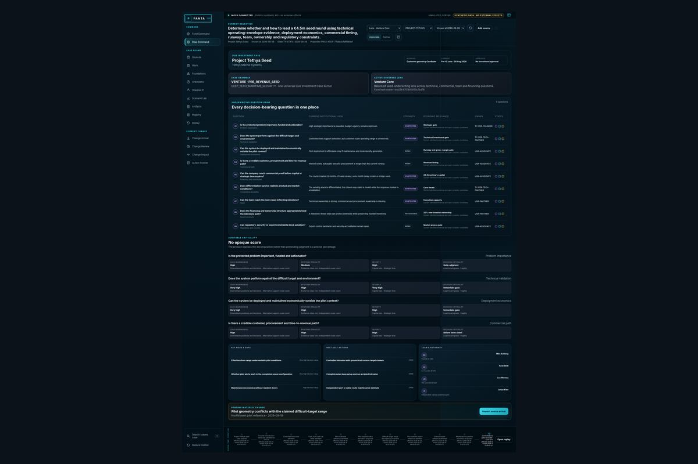

**Purpose:** orient the professional to the venture archetype, current Lens and decision-bearing questions.  
**New elements:** Case Grammar, governed Lens, stable facts hash and decomposed criticality.  
**Acceptance:** changing Lens changes question emphasis but not the facts hash.

## 2. Sources - Native Interactions

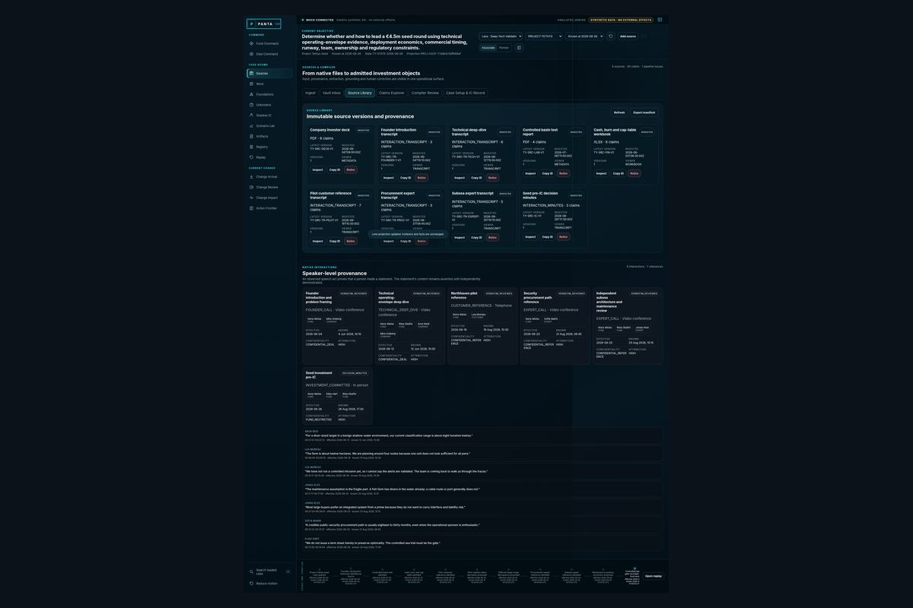

**Purpose:** make calls, interviews and transcripts inspectable as native evidence.  
**New elements:** participants, party, effective/known dates, confidentiality, attribution and utterance list.  
**Error state:** missing consent or attribution remains explicitly review-required.

## 3. Object Aperture - Utterance

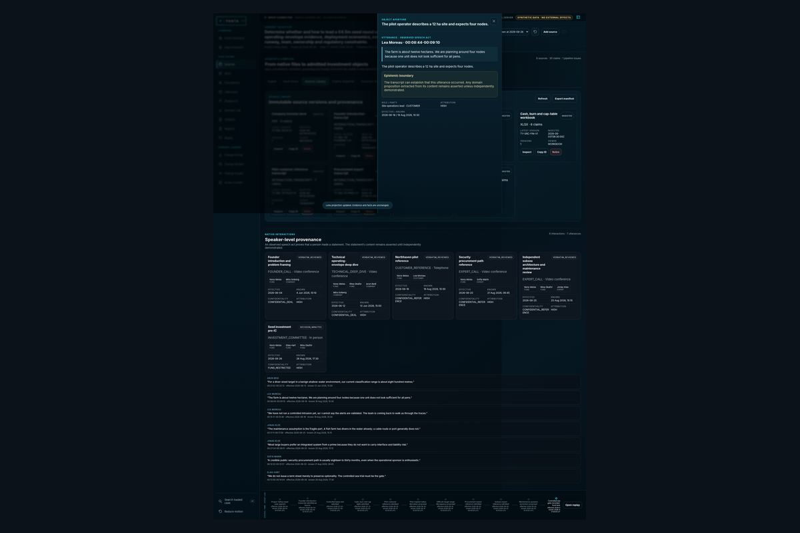

**Purpose:** inspect the exact statement and the boundary between speech occurrence and domain truth.  
**Critical copy:** the transcript can establish that the utterance occurred; extracted content remains asserted unless independently demonstrated.

## 4. Compiler Review - Venture Proposals

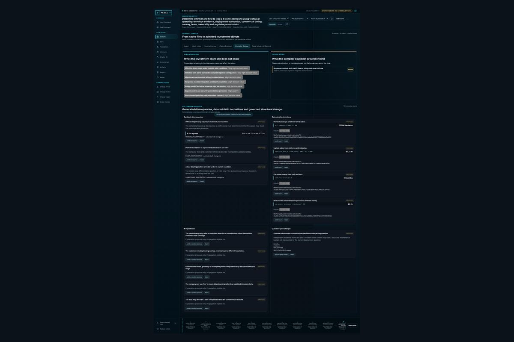

**Purpose:** review generated discrepancies, deterministic derivations, AI hypotheses and question-spine changes.  
**Guardrail:** no object is admitted automatically.  
**Authority:** material spine changes use the Lens-provided authority verb.

## 5. Foundations - Validation Envelopes and Conditions

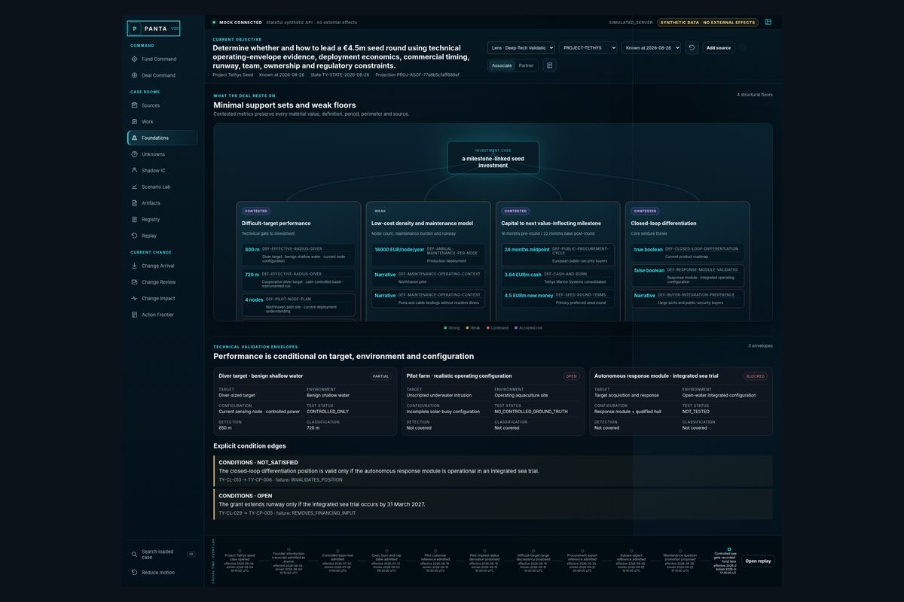

**Purpose:** prevent scalar technical claims from escaping their target, environment, configuration and test status.  
**New elements:** validation envelopes and explicit condition edges.

## 6. Unknowns - Governed Missions

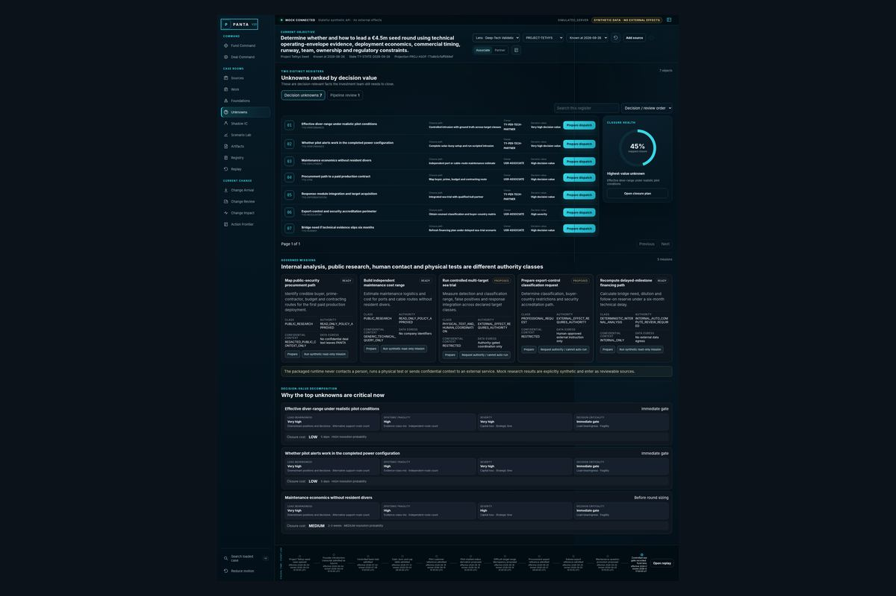

**Purpose:** show why an unknown matters and how it may be closed.  
**New elements:** mission authority classes, allowed/prohibited sources, egress policy, closure cost and resolution probability.  
**Boundary:** human contact and physical tests cannot auto-run.

## 7. Scenario Lab - Venture Financing

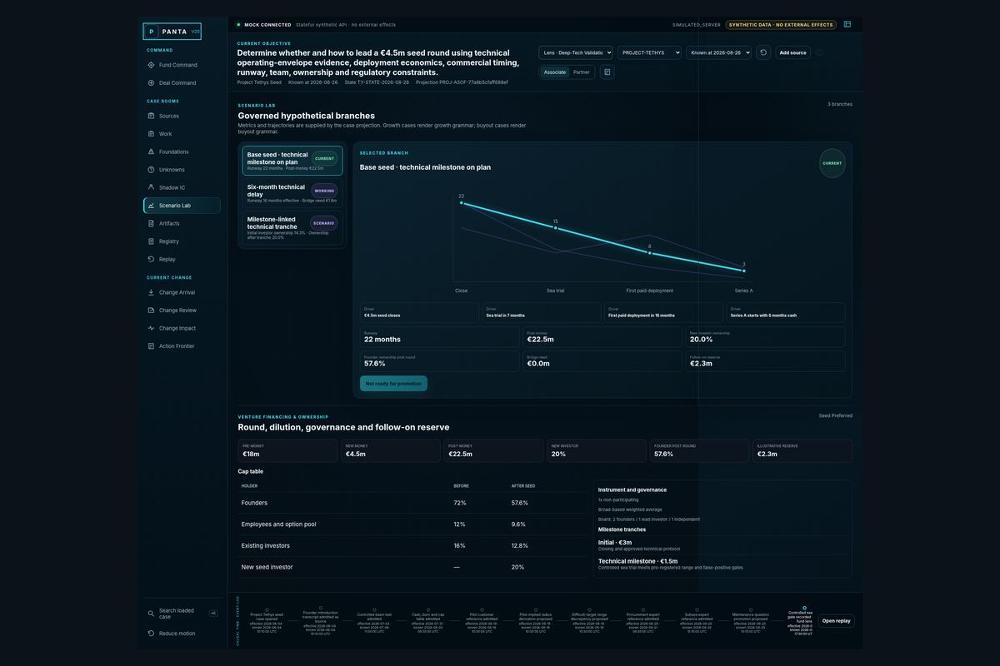

**Purpose:** model round mechanics, cap table, dilution, runway, milestones and follow-on reserve.  
**Branch:** all scenarios remain Working until admitted and settled.

## 8. Causal Replay - Venture Case

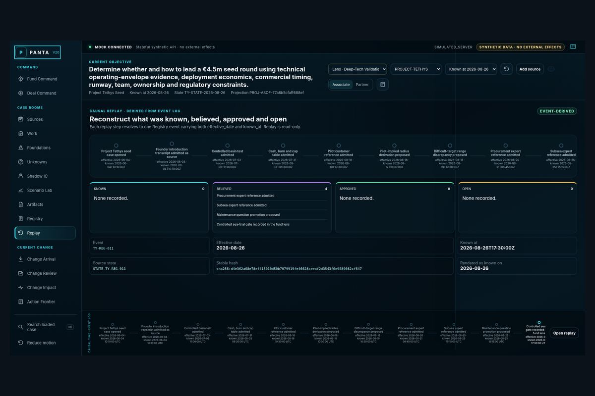

**Purpose:** reconstruct what was known and institutionally recorded at a historical date.  
**Integrity:** event-derived, bitemporal and read-only.

## 9. Change Impact - Human Stop

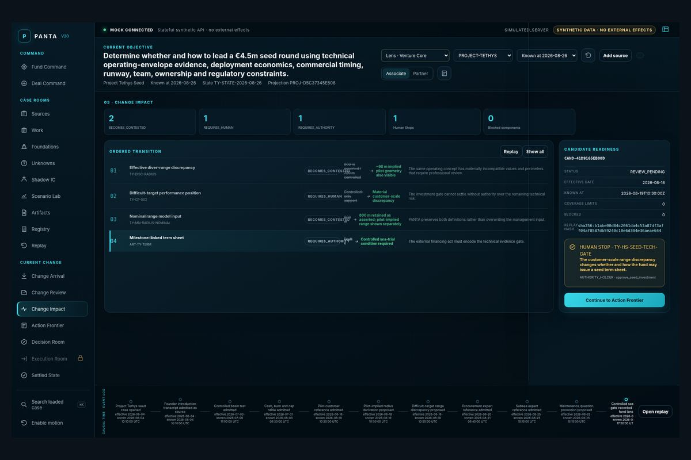

**Purpose:** expose a material technical discrepancy that requires scoped seed-investment authority.  
**Settlement rule:** server refuses settlement without a matching authority record.

## 10. Change Impact - Blocked Component

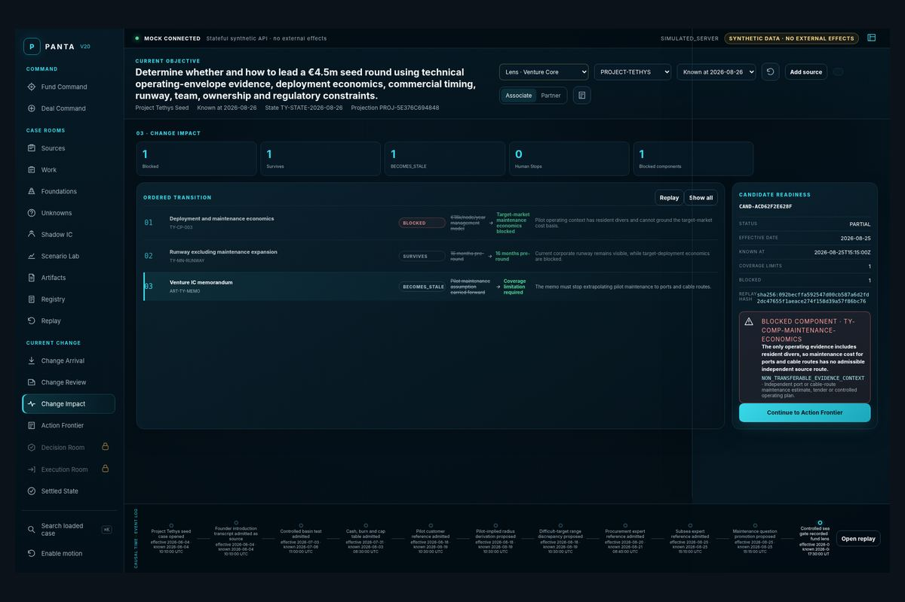

**Purpose:** preserve a region whose evidence is not transferable.  
**Settlement rule:** independent scope may settle only through explicit bounded partial settlement; the blocked region persists.

## 11. Mobile Read/Review

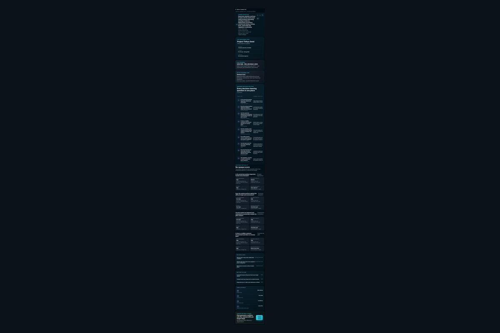

**Purpose:** provide legible orientation and review below 768 px without compressing formal authority into an unsafe mobile interaction.

# Object-branch inventory

V20 adds generic Object Aperture branches for Interaction, Utterance, Participant, Discrepancy, Derivation, Hypothesis, Agent Mission, Spine Change, Validation Envelope and Lens. These coexist with the V19 branches for claims, questions, sources, cells, artifacts, unknowns, people and transition objects.

# Visual non-regression

The V20 extension uses the existing semantic palette:

- cyan: Current/live and evidence pathways;
- violet: Working/scenario;
- gold: authority, thresholds and institutional acts;
- red: blocked/failure;
- green: settled/success;
- slate: context/history.

No new colour is assigned to venture as a separate product identity.
