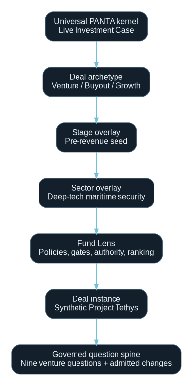
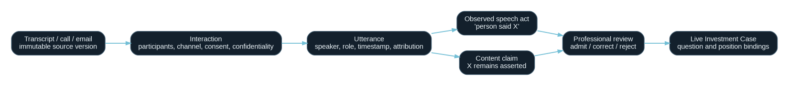
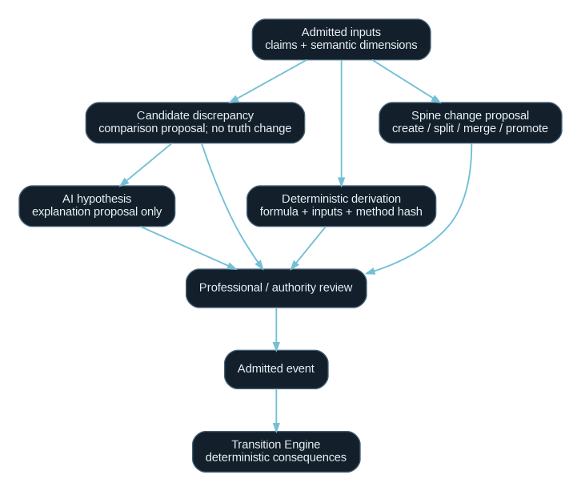
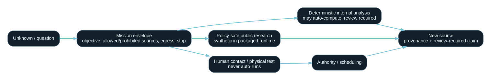
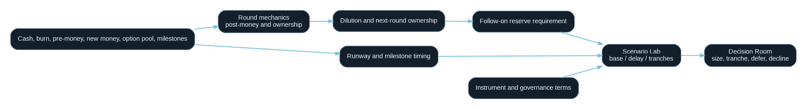

# Navigation principle

V20 retains one product and one persistent Live Investment Case. Venture capability appears inside the existing rooms; it does not create a venture application or a parallel source of truth.

# Persistent navigation

1. Fund Command
2. Deal Command
3. Sources and Compiler
4. Work
5. What the Deal Rests On
6. Everything We Still Do Not Know
7. Shadow IC
8. Scenario Lab
9. Artifacts
10. Registry
11. Causal Replay

Object Aperture remains contextual. Change Arrival, Change Review, Change Impact and Action Frontier remain transient. Decision Room and Execution Room remain gated. Settled State remains a completion surface.

# Archetype flow

A case receives a universal kernel, archetype, stage overlay, sector overlay, Fund Lens and deal-specific question spine. The frontend consumes these as projection data.

# Interaction-to-state flow

The transcript source, Interaction and Utterance are immutable evidence objects. The compiler may propose a content claim and a separate observed-speech-act claim. Professional review controls admission.

# Proposal-state flow

`PROPOSED -> ADMITTED | CORRECTED | REJECTED`

Only admitted objects may become admitted events. Deterministic derivations and AI hypotheses remain separate object classes throughout the flow.

# Mission flow

`Unknown -> Mission proposal -> Prepare -> (policy-safe run | authority/scheduling) -> New source -> Review -> Admission`

Preparation is not execution. A mission result is not an admitted fact.

# Venture-financing flow

Financing inputs feed round mechanics, runway, dilution, reserve and scenarios. Scenario outputs remain Working and cannot change Current directly.

# End-to-end flow

The complete operating flow preserves the V19.B authority and settlement chain.

# State-machine additions

V20 adds proposal states for:

- discrepancy candidate;
- derivation result;
- AI hypothesis;
- mission;
- spine change.

These do not replace Candidate, Current or Approved. They sit upstream of the admitted-event boundary.

# Lens navigation behavior

The Lens selector is page-global and projection-driven. Selecting a Lens may:

- reorder questions;
- change ranking weights;
- raise required questions;
- change evidence thresholds;
- change authority policies and controls.

It may not modify claims, source versions, Registry history or deterministic outputs. The server exposes a facts hash to make this invariant testable.

# Temporal navigation

The as-of control is date-driven over `known_at`. A past projection filters claims, sources, interactions, utterances, missions, spine proposals and Registry events. A Lens not yet known at that date cannot leak into the historical projection.

# Route and deep-link model

The hash route continues to carry case, view, object, run and as-of context. V20 objects use the same Object Aperture route. Search indexes interactions, utterances, discrepancies, derivations, hypotheses, missions, spine proposals and validation envelopes in addition to existing objects.

# Error and blocked states

- Connected backend unavailable: explicit error; no fixture fallback.
- Missing transcript attribution/consent: review-required state.
- Discrepancy dimensions not aligned: candidate remains unresolved.
- Hypothesis unreviewed: propagation disabled.
- Mission external effect: preparation allowed, execution refused.
- Spine authority missing: review refused.
- Human Stop open: settlement refused.
- Blocked component present: full settlement refused; bounded partial settlement may proceed.
- Delivery failure: FAILED, never optimistic success.
